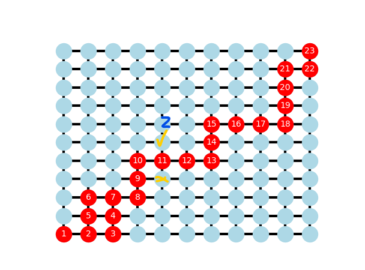

RW sink
combine

離起始點差一步
其他人越遠越好，最少兩步
盡量偏離他們

11不能選鄰居，
確認與**所有路徑**點的距離，
越長越好，如果有兩個就挑一
長不下去就不勉強，停止

與X0外距離要最小，
因為格子點所以做改變

幾個分支?
長度多少?

最後需要去算送幾個messages

主分支
-1-1-1
假路徑

有得必有失! 保護能量，失去一些人
------

attacker 有這問題
先收到，再停一陣子選擇走哪條路
停太久or有發現訊號，走回岔路

